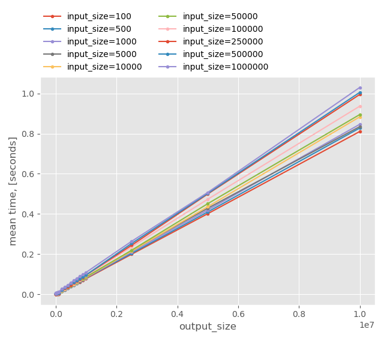
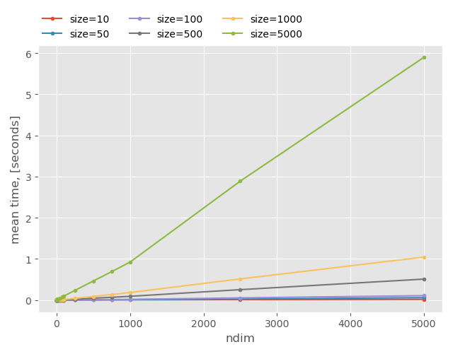
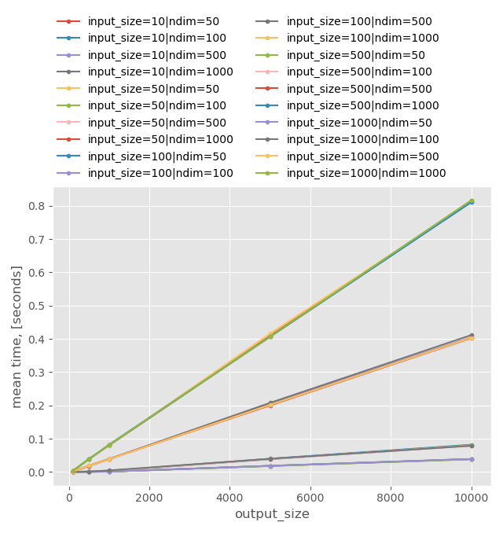
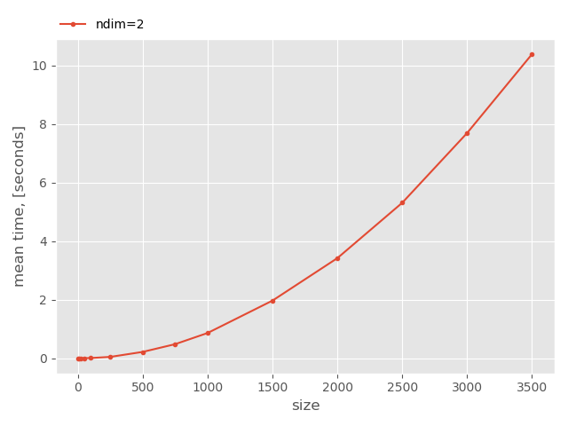
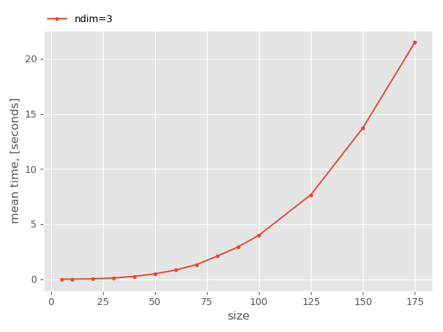
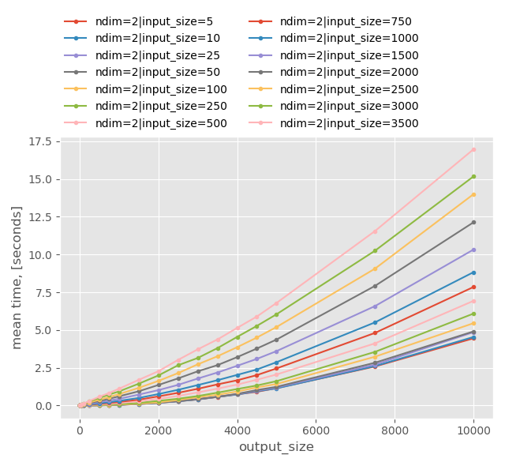
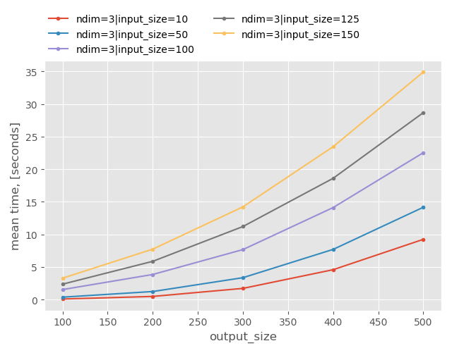

.. _benchmarks:

Benchmarks
==========

Environment
-----------

.. list-table::
    :header-rows: 0
    :stub-columns: 1
    :widths: auto
    :align: left

    * - CPU
      - Intel(R) Core(TM) i7-6700 CPU @ 3.40GHz
    * - RAM
      - 16 GB
    * - Python
      - 3.7.4 MSC v.1916 64 bit (AMD64)
    * - NumPy
      - 1.18.0 (OpenBLAS)
    * - SciPy
      - 1.4.1 (OpenBLAS)

Univariate
----------

.. note::

    Data shape is ``(size, )``

Make Spline
~~~~~~~~~~~

.. image:: _static/benchmarks/univariate-make.png

Evaluate Spline
~~~~~~~~~~~~~~~

Multivariate
------------

.. note::

    Data shape is ``(ndim, size)``

Make Spline
~~~~~~~~~~~

Evaluate Spline
~~~~~~~~~~~~~~~

ND-Grid
-------

.. note::

    Data shape is ``(size, ) * ndim``

Make Spline
~~~~~~~~~~~

Evaluate Spline
~~~~~~~~~~~~~~~

