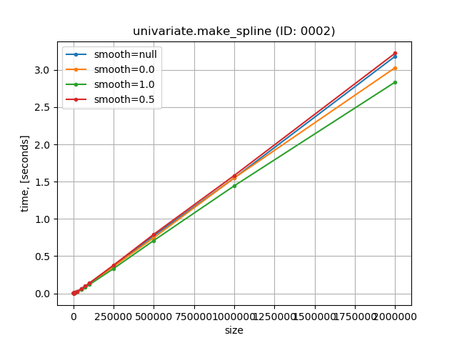
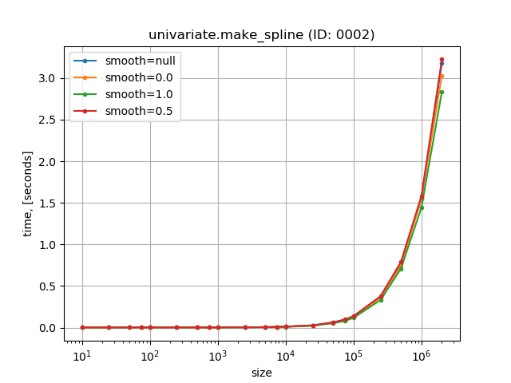
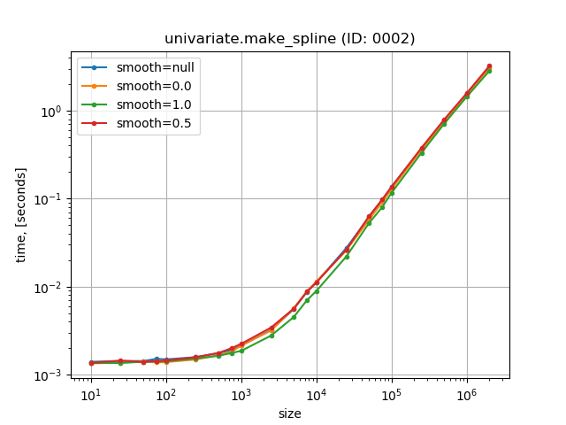
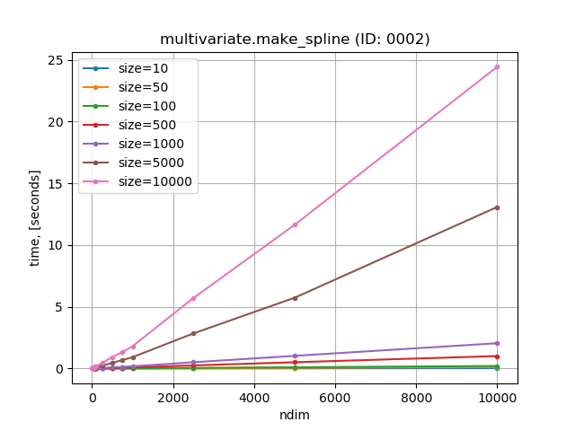
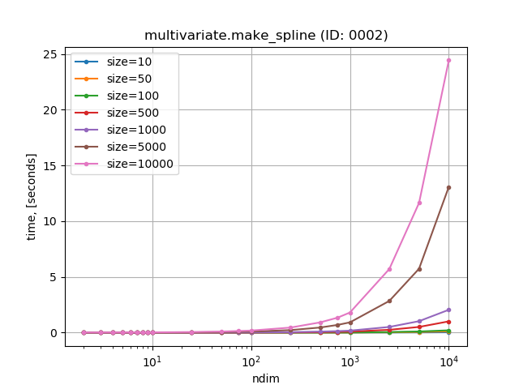
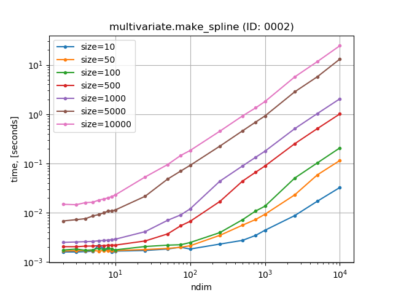

Windows-CPython-3.7-AMD64
=========================

Benchmark environment info:

.. list-table::
    :widths: auto
    :header-rows: 0
    :stub-columns: 1
    :align: left

    * - System
      - Windows 10
    * - Python
      - CPython 3.7.4 MSC v.1916 64 bit (AMD64)
    * - CPU
      - Intel(R) Core(TM) i7-6700 CPU @ 3.40GHz
    * - NumPy
      - 1.18.0 with OpenBLAS
    * - SciPy
      - 1.4.1
    * - csaps
      - 0.7.0

Univariate Data
---------------

Make Spline
~~~~~~~~~~~

Normal scale

Logarithmic X scale

Logarithmic X,Y scale

Multivariate Data
-----------------

Make Spline
~~~~~~~~~~~

Normal scale

Logarithmic X scale

Logarithmic X,Y scale

